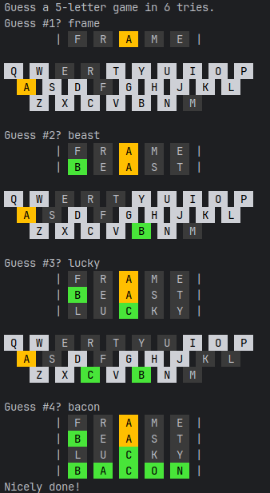

# Worder

A terminal-based word guessing game inspired by Wordle. Guess the secret word in 6 tries, with color-coded feedback after each guess.

## Usage

```bash
python worder.py           # 5-letter words (default)
python worder.py -l 6      # 6-letter words
python worder.py -l 7      # 7-letter words
```

After each guess, tiles are colored to show how close you were:

- **Green** — correct letter, correct position
- **Yellow** — correct letter, wrong position
- **Dark** — letter not in the word

The alphabet row below the board tracks which letters you've used and their status. At the end of each round, you can play again with a new word.

## Screenshot



## Requirements

Python 3.8+, no external dependencies.
